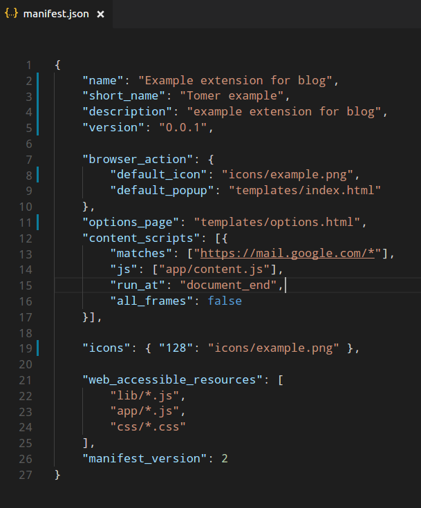
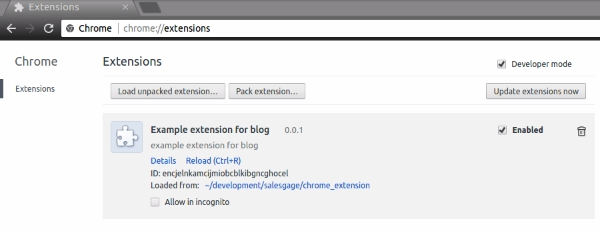

# **Congratulations, It's a Chrome Extension!**
As a young parents for our little one, my wife and I are learning the "debugging life cycle" of
babies. 

The *debugging life cycle*: the baby is crying - is he hungry? no, if yes feed him. Does he have
stomach pains? no, if yes try to make him feel better by patting on his back, for example. Does
he need a change of diaper? no, If yes, change it. If all the answers are no, you should start
again from the beginning. He is probably hungry by now. It was easier if parents knew the
diaper is clean. Moreover, the parents will be happier to know that their baby feels comfortable
with the diaper, any place, any time. 

This is the same motivation of building your own chrome
extension. We want everything 'here and now' and not to sign in to multiple systems. It
improves our user experience and helps us to work in our 'home base'. In the following
paragraphs I will describe the basics of launching chrome extension from zero as we implanted
it in **EatNgage** chrome extension, and the challenges it holds.

## **Behind the enemy line** 

Integration is one of the great challenge of technologic tools. The main challenge on this
integration is that we are behind the enemy line. We want to put our code on different
environments than our typical development environment. "Feel at home" isn't a
recommendation while developing a chrome extension, it is a way of thinking. You need to pay
attention to your development dependencies and handle it while developing your extension.

 

## **"Yes. Please."** 

There is a famous joke about a waiter who gave a fat man the menu, and the fat man replied -
"yes please". Manifest file is the menu of our chrome extension. It contains all the relevant
details about our extension, and we will order it all. Every chrome extension must include a
manifest file. It is the only principle in order to upload the extension to the store or to our
browser in developer mode.
Since 2014, the version that declares the type of the manifest file is 2 .

## **Which data will be on the manifest file?**

* `Full and short name` of the extension
* `Short description`
* `Version` of the extension.
Please note that in every upload to the store we will need to upload an extension with a newer
version, according to semantic versioning standard. 
* `browser_action` – this field describes the default icon and pop on the tool bar of the chrome
browser. If you want to add configurable options to the extension, you can add an options
page.
* `Content_script` – this field will help us survive behind the enemy line. This field has the values
of where and when the script will run. We can define where our extension will work by adding
matches key, that its value is a regex expression of URL, which will tell the browser on which
web pages to run our code.
* `Icons` - will describe the icons we will use in the extension.
* `web_accessible_resources` - this key specifies which external libraries or packages to load from
our project folder.

 

## **Developer mode**

After describing our project structure in the manifest file, the next step will be to develop our
extension functionality. After developing our first feature on the extension, we will load it
locally to our chrome browser, in order to test it and show our progress.
In order to do so – we will open our chrome extension page, `chrome://extensions/`, click on
the checkbox developer mode to enable loading the unpacked files from its' folder location.
Don’t forget to reload the extension after every change and refresh the web page you are
working on.

## **How will we upload it?**

After completing all the extension functionalities and testing it locally we want to spread out
our great extension.
You should open a developer account. It will cost you a small payment (currently 5$) for the
first time and then you can upload your extension when you wish to update it.
In this article, I tried to describe the whole picture of developing and uploading a chrome
extension. It lacks the main part of the programming, this skill you will learn with your great
teacher, you can find it in any home, mostly near the computer screen – your keyboard.

### ***Good Luck!***

### =========================
***External Links:*** 

[Manifest File Format](https://developer.chrome.com/extensions/manifest)

[Getting Started Toturial](https://developer.chrome.com/extensions/getstarted)

[Developer Dashboard](https://accounts.google.com/signin/v2/sl/pwd?service=chromewebstore&continue=https%3A%2F%2Fchrome.google.com%2Fwebstore%2Fdeveloper%2Fdashboard%3Fhl%3Den-US&passive=3600&hl=en-US&authuser=0&flowName=GlifWebSignIn&flowEntry=ServiceLogin)

[Gmail.JS](https://github.com/KartikTalwar/gmail.js/tree/master)